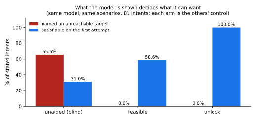
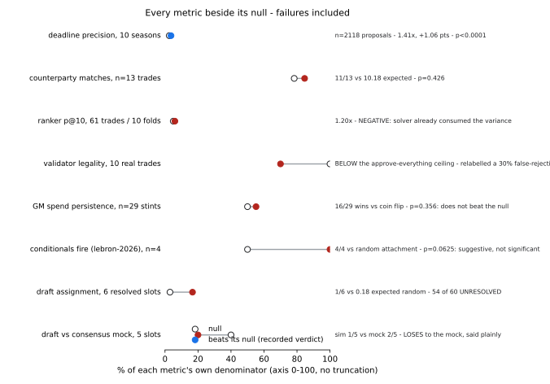
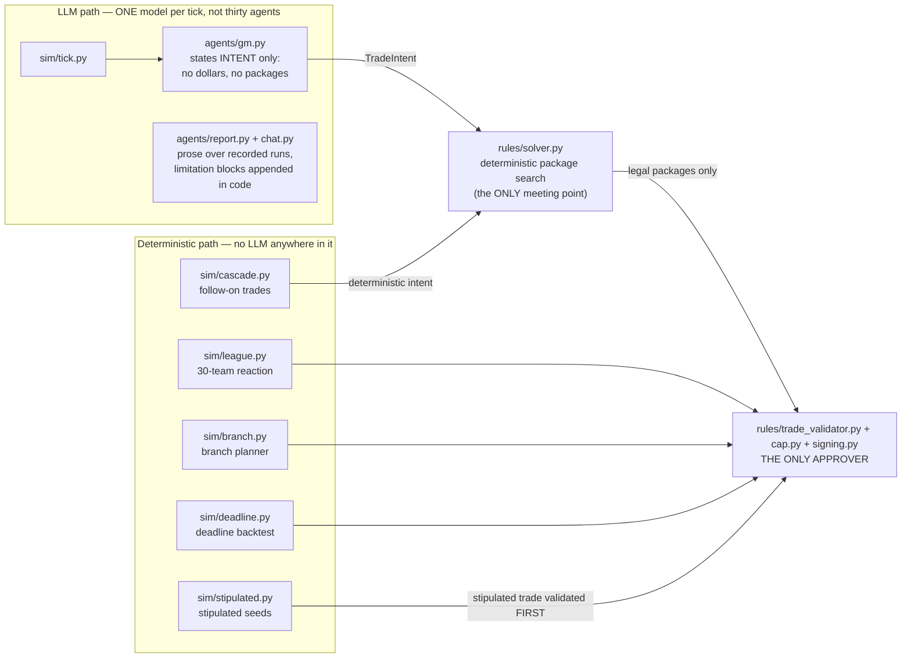
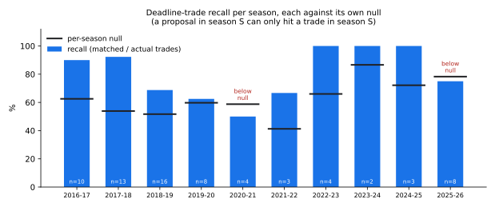
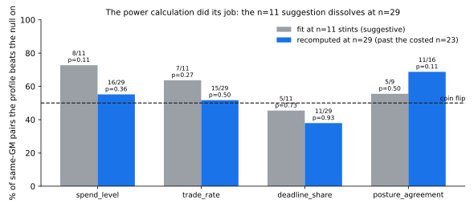

# MiroNBA

**A counterfactual-NBA simulator whose eval harness is the product: no number
ships without the score a do-nothing or random system gets on the same data.**

Seed a decision that has not happened yet — *where does LeBron James sign?* —
or stipulate one that never did — *Stephen Curry traded to the Lakers* — and
the system freezes the world at a declared instant, lets thirty teams react
through deterministic CBA rules (an LLM may *propose*; only `rules/` may
*approve*), and scores the branch that actually occurred against what teams
really did. Most of what follows are negative results. They are the point:
the simulation is ordinary; the harness around it is built to report failure
at the resolution needed to act on it.

## Quickstart

```bash
pip install -r requirements.txt
python -m mironba.eval.backtest --scenario lebron-2026
```

Recorded output of that command (2026-08-03 run; scored branch only — the
counterfactual is run and reported, never scored):

```
signings only (headline)     recall  50.0%   precision   6.2%   (hits 1 of 2)
all post-freeze arrivals     recall   9.1%   precision   6.2%   (hits 1 of 11)
contested-player accuracy    0 of 1 resolvable (0%)
```

No install at all: open the committed demo artifacts —
[`docs/example-run.html`](docs/example-run.html) (self-contained page),
[`docs/example-timeline.txt`](docs/example-timeline.txt) (the refusal-first
event feed).

## Headline results

**What the model is shown decides what it can want.** Same local model, same
scenarios, three information arms — the strongest positive result here, and a
controlled one (each arm is the others' control; stand-pat rates 19.4/19.4/20.7%
rule out "attempting less"):



**And every metric ships beside its null — failures included.** The signature
discipline, as one figure. Blue observed dots beat their null; red ones do
not, and they stay in the README:



Both figures are generated by [`mironba/report/figures.py`](mironba/report/figures.py)
from the recorded bench files and the measurements ledger — never from numbers
typed into plotting code. A moved anchor fails the build; it never silently
plots a default.

## Architecture: two paths, one approver



The two paths meet at the solver and nowhere else. An LLM cannot reach the
validator directly — illegal packages are unrepresentable, not merely
discouraged. Salary-cap math, trade legality and roster construction are
Python; a proposal the rules refuse is refused with findings, including the
project's own stipulated premises.

**Reading map**: [measured results](#what-was-measured) ·
[the boundary finding](#the-boundary-finding-rank-upstream-of-the-constraints) ·
[results that weren't](#seven-results-that-werent) ·
[the standing boundary](#the-standing-boundary) ·
[the full measurement ledger](docs/measurements.md) (62 entries — every
number, what it overturned, what changed because of it).

---

## What was measured

### An LLM cannot do salary matching: 0 legal trades in 12 attempts

Propose-validate-retry, a capable local model, the cap rules in the prompt.
Twelve proposals, zero legal, and nine repair retries rescued **none** of them.
Salary matching is a constraint-satisfaction problem over integer contracts and
the model was reliably off by millions.

So the architecture changed rather than the prompt:

```
model states an INTENT  ->  solver enumerates every LEGAL package  ->  model picks an INDEX
```

The model **does** see team payroll, apron status, and every contract on both
rosters — that is what `CONTEXT_TEMPLATE` renders. What it cannot do is **emit a
package or state terms**: it names a player, an intent, or an index, and the
solver builds the deal. Illegal proposals stopped being discouraged and became
**unrepresentable**.

*(The first sentence used to read "the model never sees a salary". That was
false for four milestones and no test covered it — see measurements entry 21.)*

### Then it wanted players it could not afford: 0 of 7 intents satisfiable

Legal-by-construction is not useful if the intent is impossible. The fix was to
compute feasibility *before* asking. Three scenarios, three arms, 29–36 trials
each:

**All figures below are POOLED across three scenarios.** They may not be placed
beside per-scenario numbers — doing exactly that produced the seventh error
above. The arm formerly called `blind` is now `unaided`: it meant "without the
feasible-target list", never "without money".

| *(pooled, 3 scenarios)* | unaided | feasible | unlock |
| --- | --- | --- | --- |
| Named an unreachable target | 65.5% | **0.0%** | **0.0%** |
| Intent satisfiable, first attempt | 31.0% | 58.6% | **100%** |
| Intent satisfiable, final | 58.6% | 75.9% | **100%** |
| LLM calls spent | 102 | 99 | **75** |

Telling the model *which of its own contracts unlock each target* closed the gap
completely — 23 of 23 on the first attempt, at **a quarter fewer calls**,
because no revision round was ever needed. Stand-pat rates are 19.4 / 19.4 /
20.7%, so this is not the model simply attempting less.

The model then **declined 16 of the 23 legal package sets it was shown**. On an
apron team whose only legal moves are cheap-for-cheap swaps that is a defensible
read of a thin market — but solving feasibility produced *informed refusals*,
not trades.


### Model comparison: where constraints bind, only the scaffolding works

Qwen 27B against three hosted models, `unaided` arm, **per scenario** — not
pooled, for the reason given above. 12 trials per cell unless noted.

**Los Angeles — above the first apron, constraints bind:**

| model | arm | acted | 1st attempt | final |
| --- | --- | --- | --- | --- |
| Qwen 27B | unaided | 12/12 | **0/12** | **0/12** |
| Sonnet 5 | unaided | 12/12 | **0/12** | **0/12** |
| Opus 5 | unaided | 12/12 | **0/12** | **0/12** |
| **Qwen 27B** | **unlock** | **21/21** | **21/21** | **21/21** |

**No model succeeds unaided, at any capability.** A frontier model is not better
than the 27B here — all three are at zero. The scaffolding takes the *weakest*
model to 21/21.

**Chicago (over the cap, clear of the aprons) and the positive control (under
the cap, ten legal packages verified before any model saw it):**

| model | Chicago 1st / final | control 1st / final |
| --- | --- | --- |
| Qwen 27B | 5/12 → 12/12 | 5/14 → 8/14 |
| Haiku 4.5 | 0/12 acted at all | 2/12 → 8/12 |
| Sonnet 5 | 11/13 → 12/13 | **0/12 → 12/12** |
| Opus 5 | 9/24 → 23/24 | **12/12 → 12/12** |

Capability does substitute where constraints do not bind: Opus is 12/12 on the
first attempt at the control where Qwen manages 5 of 14. **Sonnet's control cell
is the one place the retry does all the work** — 0/12 first attempt, 12/12
final, meaning every intent it formed was initially unsatisfiable and every one
was rescued by a single revision round.

The control exists because the other scenarios cannot separate good judgment
from refusal: declining a bad trade is correct and most trades are bad. Haiku
standing pat 24/24 elsewhere was unreadable until it acted 11/12 here — it was
judging, not refusing.

**These numbers are not sampling-matched.** `temperature` is deprecated on
Sonnet 5 and Opus 5 (HTTP 400), no seed is available on any of them, and their
manifests are flagged `NOT REPRODUCIBLE` with the reason recorded. The Qwen arms
ran at temperature 0.8 with a fixed seed. The comparison supports a claim about
*which arm wins*, not a precise ranking between models.

### The value model is directionally useful and not demonstrably better than regression to the mean

Pooled MAE **7.49 wins** against **7.99** for "last season, regressed to .500".
Paired over 120 team-seasons that is **p=0.159**, and dropping a single season
collapses the edge from 0.50 wins to 0.13. It is kept, and it is reported as not
beating the baseline.

### A win delta carries about 10.5 wins of error, measured

Two earlier figures — 12.05 and 2.00 — were both theoretical and disagreed about
everything that mattered. Measured against **180 real team-season transitions**:

| | sd | MAE | |
| --- | --- | --- | --- |
| all transitions | **10.48** | 8.20 | r = +0.49 |
| low-disruption subset | 7.40 | 7.03 | n=30 |

An earlier claim that options 3 wins apart were rankable was **withdrawn** — the
pessimistic of the two theories was nearly right. The comparison layer now
refuses to rank inside its own error bar: two projections must differ by
**10.5 wins** to be called apart, which is `z·sd·√2` on the *favourable* 7.40
subset. Three options at 44.2, 42.9 and 41.4 come back as one tier.

### The deadline planner does not beat a random proposer

The only place the trade solver is scored *predictively*, and the result is
negative in a way that took a null baseline to see. All three seasons now have
standings coverage, so the planner runs everywhere:

| | 2023-24 | 2024-25 | 2025-26 | pooled |
| --- | --- | --- | --- | --- |
| proposed | 213 | 208 | 252 | **673** |
| distinct pairs covered (of 435) | 212 | 206 | 244 | — |
| % of the pair space | 48.7% | 47.4% | 56.1% | — |
| real trades in window | 2 | 3 | 8 | **13** |
| matched | 2 | 3 | 6 | **11** |
| recall | 100% | 100% | 75% | **85%** |

**Read the third row before the last one.** The proposals cover about half of
all 435 team pairs, and a two-team proposal counts against a three-team trade,
so each real trade has three chances to be hit:

| | observed | null | |
| --- | --- | --- | --- |
| counterparty matches | 11 of 13 | **10.18 expected** | P(null ≥ observed) = **0.426** |
| precision (10 seasons, n=71) | **3.64%** | **2.57%** | **1.41x**, +1.09% headroom |

**Corrected.** This table read "null 6.67%, below chance" until the pooled null
was audited. It was computed as the union of qualifying pairs across seasons
divided by 435 — but a proposal in season S can only hit a trade in season S,
so the null is a per-season quantity and pooling it means weighting by proposal
count. The union credited the null with pairs no proposal could ever have hit.
Corrected, precision is marginally *above* chance rather than 3.7 points below
it. See measurements entry 26; 1.24x on 13 positives is not a result either.



**The advantage survives a null given the planner's own team-activity bias**
(the planner does have one, r=+0.342), so it is not explained by having learned
which teams trade. That is the first claim here to survive a null designed to
kill it. The headroom says how small it is: **+1.09%** of the distance between
chance and perfection. Ratio and headroom are quoted together everywhere —
1.41x sounds like a finding, +1.09% says how much of one.

**Statistically clear, practically small.** Those two things are both true and
neither cancels the other. The p<0.0001 reflects 2118 proposals — with a sample
that size, a 1-point difference is easy to establish. The **+1.09% normalized
headroom** is the size of the thing established. A reader who takes only the
p-value away has the wrong impression, and so has one who takes only the
headroom.

**The test's power is bounded in both directions by coverage breadth.** At ~50%
of the 435-pair space, the null is dominated by how wide the enumerator casts
rather than by what it selects — which is why the team-activity bias could not
express itself, and equally why a genuinely good selector would struggle to
separate from the null here. The comparison is honest but not sensitive.

**Two independent full runs produced byte-identical per-season figures.**

The counterparty metric remains indistinguishable from chance.

Two named causes were fixed before this — the disposition gate and the absence
of any player value — and precision did not move. A third refinement moved
proposals 421 → 415 and precision not at all.

**The planner enumerates legal permutations; it does not model a market.**

### Ranking does not work on features the solver has already consumed

The enumerator is a retrieval stage — 2118 proposals against 71 real trades is
what retrieval looks like when it works. So precision was supposed to move to a
second stage: retrieve wide, rank the head. It was fitted and it does not work.

**1637 complete-feature rows, 82 positive pairs, 61 distinct trades**, ten
seasons, leave-one-season-out, logistic regression. A trade counts once however
many of its pairs surface.

| | p@1 | p@5 | p@10 |
| --- | --- | --- | --- |
| test | 0.0% | **6.0%** | **6.0%** |
| train | 0.0% | 2.0% | 3.0% |
| **random ranker** | **5.01%** | **5.01%** | **5.01%** |

**p@10 of 6.0% against 5.01% is 1.20x on 61 trades across ten folds — inside
noise.** The ranker does not beat a random ranker.

**The player-level reframe (entries #63-#64) — a different unit, corrected
twice, and it works modestly.** The pair result above stands untouched; the
new question is *entering January, will this player be traded by the
deadline?* — n=5,631 (player, deadline) rows across ten deadlines, 353
positives (6.3% base rate), per-class feature missingness stated before
fitting. **The first two fits were contaminated by one leak class and are
recorded, not erased**: bbref's contracts row lists a traded player under
his acquiring team (roster team ≠ last pre-deadline team for 84–91% of
positives vs 8–12% of negatives), and fixing that by cutting features at
the deadline exposed the second — January trades sit inside the label
window and wrote themselves into the features (the leak *inflated* p@25 to
24.0%). Features now cut strictly at Jan 1, the label window's own start,
with the team entering January log-derived. The chain also named a standing
rule (entry #65): closing a leak should *lower* a result — when a fix raises
a number, that rise is evidence of a second leak, not a better model, and
nothing is reported until it is explained. The clean numbers:

| | observed | null (mean ± sd over 10,000 draws) | ratio / headroom |
| --- | --- | --- | --- |
| mean p@25 | **11.2%** | 6.3% class-balance | 1.78x, +5.2% of chance-to-perfect |
| mean p@25 | **11.2%** | **7.0% ± 1.5% within-team** (preserves each team's trade frequency; absorbs team_prior_rate) | **1.57x**, P(null≥obs)=0.0026 |
| mean test AUC | **0.647** | 0.5 random | train — no overfit gap |

**Plainly**: of 25 players flagged per deadline, ~2.8 are traded, versus
~1.6 at chance and ~1.8 under the within-team null. A randomly chosen
traded player outscores a randomly chosen untraded one 65% of the time
(a coin flip would be 50%). These are the PROMOTED interaction model's
numbers — see the settle paragraph below for what changed and why; the
additive model's 9.6%/0.645 remain recorded in the bench and entry #64.

**The decomposition says what the signal is.** Availability split into
components: `window_share` −0.43 (fewer recent appearances → traded),
`never_active` −0.28 (never-appeared players are *less* traded — two-ways
and stashes are not trade chips), `injured_shaped` −0.15, and
`switched_pre` collapsed from +0.29 to +0.01 once January moves left the
features — its earlier weight *was* the leak. With `log_salary` at +1.08,
the finding reads: **paid-but-not-playing players get traded — a
marginal-rotation effect, not an injury effect.** The ablation is the
claim's control: salary + prior team rate alone score p@25 5.2% — under
the base rate — so the appearance components carry the entire +4.4-point
lift. Expiring-contract status is not computable for any season (the
forward-looking snapshot had already dropped ended contracts, and
forward-absence inversely encodes the label — the test built to pin the
feature is what exposed it). Availability reaches this model under a
narrowed fence: the ranker is the one permitted consumer; the planner and
value model still may not read it. **The interaction, tested then settled (entries #66–#67).** Salary+team-rate
alone scoring *below* the base rate while log_salary carries the largest
coefficient means salary is informative only conditioned on playing time —
so the product term (salary × low-minutes among pre-January actives) was
fitted explicitly. It sharpened the head (p@25 9.6% → 11.2%, AUC flat) and
the main effects migrated into the term exactly as predicted (window_share
−0.43 → +0.17; the term +0.45) — but on one Monte Carlo draw of the fold
null, that was left as suggestive. **The settle run put intervals on it**:
10,000 paired within-team draws — the same permuted labels scoring both
models' heads — give a non-degenerate null for the difference (mean −0.05%,
sd 0.55%, 95% interval [−1.2%, +1.2%]) and the observed +1.6-point
improvement sits at **P(null ≥ obs) = 0.0044**, with the additive model at
P=0.035 and the interaction at P=0.0026 against their own nulls. Fold
bootstrap of the difference: +1.61% [0.0%, +3.2%], interaction winning 5
folds and tying 4. Per the rule stated before the draws ran, the
interaction model **is now the recorded headline**; the additive numbers
stay in the bench as the superseded step.

Recorded in `bench-player-ranker.json`;
regenerate with `python -m mironba.eval.player_ranker --fit`.

Two things it would be easy to over-read, and neither says what it looks like:

- **p@1 = 0% in all ten folds is uninformative.** Under a 5.01% baseline, zero
  hits in ten single-item draws is the *most likely* outcome. It is not
  anti-signal.
- **Train scoring below test is not overfitting** — the direction is wrong for
  that. It is variance on small folds, and calling it either way would be
  reading noise.

**The explanation is the result.** The largest coefficient is salary similarity
(+0.168 standardised): teams with comparable payrolls trade with each other.
That is close to mechanical, because **salary matching requires comparable
money and the enumerator already enforces it**. Every negative in the training
set is a *legal* proposal — it survived the solver. The discriminative variance
was consumed at retrieval.

> **Retrieve-then-rank requires the ranker to hold information the retriever did
> not use.** Here it does not, and no amount of tuning changes that.

What would be needed, and none of it is in the ingest: positional need, contract
timing, front-office relationship history, age curves, availability.

**Limitations.** `record_gap` was never populated — standings were not wired
through the capture — and is declared absent rather than advertised. The
completeness restriction drops 25% of positives and biases the survivors toward
established players.

**The enumerator's own result is unaffected**: 1.41x, +1.09% normalized
headroom, p<0.0001, surviving a null built from its own team-activity bias.

### The validator's legality rate is a false-rejection rate

The README used to say "5 of 5 on real trades". Every real trade in that set is
legal — the league approved them — so **a validator that approves everything
scores 100%**, and that is the null. Nothing here can reward catching an
illegal trade, because the set contains none.

| verdict on real trades | n |
| --- | --- |
| APPROVED | **0** |
| UNDETERMINED | 7 |
| REJECTED | 3 |

Ours scores **70%** against a 100% null: a **30% false-rejection rate**. And the
70% counts `UNDETERMINED` as legal — with those excluded it is **0 of 3**, because
no real trade is ever approved outright. Every non-rejection is an undetermined,
usually base-year compensation needing a re-sign status the ingest lacks.

That the validator *rejects* illegal trades is shown by the M0 synthetic
coverage matrix, which contains illegal ones. The two are no longer conflated.

---

---

### Thirty agents, and what the words mean

The full-league run — all 30 teams planning the same offseason branch, same
seed, competing for the same free agents — completed in ~13 minutes with
**zero LLM calls**. That is not an optimisation; it is what the run is. The
branch, league and deadline planners are **deterministic** (`sim/branch`,
`sim/league`, `sim/deadline` in the diagram), so a failure is attributable to
rules and data rather than to sampling. The language model is exercised in one
place: the **trade-intent loop** (`agents/` + `sim/tick`), which is where the
three-arm A/B was measured and where every LLM figure in this README comes
from. The two paths meet at the solver and nowhere else.

What the run showed: adding 25 competitors changed the signing sets of **4 of
the 5 scored teams** and moved **no scored metric** — the one hit is the
stipulated branch premise in both configurations. A later repair
(entry 46) rebuilt the contested resolver's tiers from the *freeze* roster
rather than 2026-27 outcome rosters, with the prediction committed first:
teams should look more alike in July, so ARBITRARY should rise from zero. It
did — 0 → 3 of 8, and the five contested wins the outcome rosters had handed
Golden State vanished. Third independent arrival at the same conclusion:
money and roster tier cannot separate contenders in July. **More agents is a product
feature, not evidence of better forecasting**, and the measurements file says
so in those words (entry 41).

### Suitor identification is not derivable from structural data

A two-sided negative, reached by exhausting the alternatives rather than by
assumption:

| filter | admits | reported suitors excluded |
| --- | --- | --- |
| cap feasibility (dated + expiry, validated) | 24/30 | CLE |
| record precedent (43 signings, 9 offseasons) | 30/30 | none |
| intersection | 24/30 | **CLE — a real suitor** |

At the July moratorium, almost any team can legally sign a veteran star to the
minimum, and the worst team in a nine-offseason sample has signed a star-priced
veteran — so neither cap position nor record excludes anyone, and the
intersection still drops a team that actually pursued him (Cleveland, whose
roster-as-it-stands is full of deals a GM could clear but has not). **Who is
actually in on a player lives in reported interest — evidence, not
derivation.** That is what motivates a news ingest, and the motivation is
earned: both structural routes were built, validated and run before being
found insufficient.

The ingest exists now: typed `reported_interest` rows in the evidence store,
each **derived from an already-verified anchor item** — dates, sources and URLs
copied from the anchor, so a row is a restructuring of a curated claim, never a
new one. Typing immediately corrected a figure: the "six reported suitors" were
**five** — LAL had entered the set via a substring match on a *departure* fact.

**And because reported interest seeds the suitor set, suitor identification is
retired as a scored metric** — once the set is an input, identifying it is
stipulated, not predicted, the same rule as the LeBron→PHI branch premise. A
test asserts no scored output is computable without POST-freeze access. What
gets scored instead, each with its null: who *wins* given the set (sim said GSW
by an arbitrary resolution, actual PHI — uninformative at n=1: a chance proposer misses 75% of the time, and the resolver itself called the choice arbitrary); what losers
did with held capacity (sim had GSW chasing Paul George and Jerami Grant; real
GSW re-signed Green at $27,678,571 and retained four others — 0 of 6 against a
recall ceiling of 1 in 6: the league planner's pool is built from the 2026-27 table, which had already excluded every re-signee, so the metric had no power by construction. The branch planner's move set is precisely retention, and it is scored separately - not in
the planner's move set); and whether conditional commitments attach to the
branch matching their condition (4 of 4, p=0.0625 - suggestive, not significant, the same threshold refused on the era gap).

**The limit, stated:** this works for one scenario. The ranker would need
reported interest across 71 deadline trades over ten seasons — hundreds of
hand-dated items, with dating increasingly unreliable back toward 2016 — and it
would still lack the orthogonal features (positional need, contract timing,
availability) named in the ranker section. The news ingest addresses the branch
scenario, not the ranker.

**Where the news layer stands.** It is complete for what it can establish at
this scale: one metric with power - conditional commitments attaching to the
branch matching their condition, 4 of 4 at n=4, **p=0.0625, suggestive and not
significant**, the same threshold refused elsewhere in this project. Reaching
significance is a scoped next step, not an open gap: conditional commitments
curated from two or three more offseasons would put the same mechanism check
past the line. The surface now renders the ledger it rests on - the branch
fork shows which commitments fired in which world (the Green opt-out is the
case that makes the two Golden State worlds differ), dated PRE-freeze interest
appears above the feed marked as an input, and every rendered item carries its
date, source link and anchor. That display *is* the claim: not prediction -
provenance.

**What generalises, stated exactly.** The deadline path runs across ten
seasons. Every layer now runs across *declared* scenarios: SCENARIO_DEBT
went from eight enumerated modules to zero, the fence and stale checks admit
no module, and davis-2026 (outcome verified against the contract snapshot)
runs the full sim end to end with zero code changes. What that supports is
still a bounded claim - two pending-decision scenarios and one stipulated
demonstration have run, not "any NBA scenario" - and two hardcodes the fence
could not see (they were plain strings, not identifiers) were found and fixed
only after the gate. Curation is assisted but never automatic: RSS
supplies real publication timestamps (feeds without them are excluded), an
LLM drafts typed rows into a review queue with the source sentence quoted, and
the store has exactly one writer, which refuses anything a human has not
explicitly confirmed. The live feeds reach back about two days. A **standing
archiver** (`python -m mironba.data.ingest.archive`, scheduled twice daily at
09:00 and 21:00) appends every dated item to `archive/rss/YYYY-MM-DD.csv`
partitions - append-only, one writer, under the enumerated writer test, with
`published_at` and `fetched_at` recorded separately - so a scenario declared
months from now can read history captured as it happened. That serves
scenarios **forward only**: nothing can be archived retroactively, and
historical scenarios remain hand-curated.

Every day is accounted for, and gaps are expected rather than exceptional:
the local scheduled tasks run only while the machine is logged in, which is
a known, named gap source - so a **GitHub Action polls twice daily from
cloud infrastructure** (`.github/workflows/rss-archive.yml`, cron offset
from the local runs) and commits the dated partitions back. What it commits
is feed-provided syndication metadata - feed, url, title, the feed's own
snippet, published_at, fetched_at - no scraped article bodies, matching the
policy already in force (partitions tracked since the archiver's first
commit; poll.log gitignored). Two writers, ONE record: the repo at
origin/main is the archive of record, and both sides commit into it - the
cloud job pushes its partitions, and the local tasks now run
`scripts/local-archive.cmd` (pull -> poll -> commit -> push) instead of
silently appending to a working-tree fork (entry #70: the old task never
pulled or committed, and divergence surfaced only as a pull refusal on the
next human sync). Same-day two-writer appends resolve through the
committed `merge=union` attribute on the partitions - correct precisely
because they are append-only with reader-side URL dedup (both the merge
artifact and the full two-branch fork are tests, and a real forced
divergence was merged live with zero duplicate rows). Every health line
now names the copy it read and its sync state against the record, so a
coverage report can no longer be green for a surface the record
contradicts. So every poll writes a marker even when it appends
nothing - an absent partition and an empty poll must never look the same
(the sentinel-for-absence failure class) - and `--coverage` enumerates every
day from the first partition to today, listing each missing day and the
longest gap. Recovery is honestly scoped: the poll measures each feed's
actual reach (3 days at last measurement, not the assumed 2) and recovers
only gaps inside it; anything older is marked **UNRECOVERABLE-BY-RSS** with
the range, never retried, never reported as success, and a test asserts an
out-of-reach gap can never flip to recovered. `--window <scenario-id>` reads
a declared lookback (default 90 days) before a scenario's freeze and reports
days requested, days covered, and every gap by range BEFORE returning
anything; survivors go to the same review queue as live ingest, and the gap
statement is appended to the scenario's own `archive-window.txt` - both
current scenarios report 0/90 covered, BEFORE-ARCHIVE, which is the
forward-only limit stating itself. `--catch-up` polls now and extends the
archive forward by feed reach (~2-3 days), not by a window: coverage comes
from the schedule, not from remembering to run it. The archive's own health
is visible without asking: every command that touches it prints coverage
first (days covered, longest gap, unrecoverable count), a newest partition
older than 2 days is announced as **ARCHIVE STALE - the schedule is broken**
with the last successful poll's timestamp (the failure that costs the most
and announces itself the least), and `--health` is the five-second
after-a-week-away view: first/last partition, days covered over expected,
unrecoverable ranges, next scheduled run.

**Wayback CDX spike (negative, measured):** the one route that could backfill
history or fill UNRECOVERABLE gaps is the Internet Archive - a capture
timestamp is a third party attesting the text existed by that date, which is
exactly what PRE requires and stronger than a page's self-reported date. The
spike (one publisher, the 2026 draft window, `wayback_spike.py`) found 258
captured URLs under hoopsrumors.com's May-June 2026 paths, snapshots
resolving 5/5 - and **0 of the 26 curated rows are discoverable: all four
source articles were never captured by Wayback at all**, not captured late.
Recall 0/26; per the brief, historical stays hand-curated and gaps stay
declared rather than filled.

## Seven results that weren't

Every headline number below survived at least one revision, and seven were
wrong at the time they were first written down. They are listed because the
pattern is the most transferable thing this project produced — more so than
anything about basketball.

**Recall of 200%.** `pair_hits` counted *proposals* that matched a real trade;
recall divided it by the number of *real trades*. Several proposals can hit one
trade, so the ratio exceeded 1. Caught by printing the per-season table and
reading a percentage above 100 — the arithmetic had never been looked at, only
the trend.

**Validator legality of 5 of 5.** `TradeCheck.legal` counted `UNDETERMINED` as
legal. Rebuilding the verdict distribution gave APPROVED 0, UNDETERMINED 7,
REJECTED 3 — **no real trade is ever approved outright**. Worse, every trade in
that set was legal, so a validator approving everything scores 100%: the metric
was a false-rejection rate against a null it had never been compared to.

**Counterparty matching, 11 of 13.** Never tested against a null. The proposals
cover ~48% of all 435 team pairs, and a three-team trade is matched by any of
its three constituent pairs, so chance alone scores 10.18. **p = 0.426.** A
20,000-trial Monte Carlo put the observed value inside the null distribution's
bulk. Caught by asking what a random proposer would score.

**A canary recorded as passing on a hosted model.** The throughput canary exists
to catch a *local* server that has silently spilled weights to system RAM. The
first hosted run recorded `canary_tokens_per_s=102.56` — a real number,
measuring network latency and someone else's load, that would have read as a
pass. **A canary that cannot fail is not a check.** Caught by reading the
manifest of a run rather than its summary line.

**Sampling parameters recorded as values never sent.** Manifests carried
`top_p=0.95` and `seed=20260730` for Anthropic runs. The provider sends neither
— the API rejects `top_p` alongside `temperature` and has no `seed` at all — and
Sonnet 5 and Opus 5 reject `temperature` outright with an HTTP 400. Caught by a
400 on a live call, which raised the question of what else in that row was
fiction.

**"The model never sees a salary" — a claim that was false for nine
milestones.** It appeared in the README twice and in `agents/gm.py` once, and no
longer appears anywhere as an assertion (see measurements entry 21). `CONTEXT_TEMPLATE` renders team payroll, apron
status, and `${salary:,}` for **every player on both rosters** — 29 money
strings in the first prompt of every arm. Caught by accident: Claude Haiku cited
"$55.7M" in a stand-pat reason, and checking whether it had recalled that or
been handed it produced the answer.

**Qwen's 31% and 65.5% in a per-scenario column.** Both figures are correct
*pooled across three arms*. Placed beside per-scenario hosted numbers they
asserted something the data never said. The real per-scenario figure for Qwen
unaided on the apron scenario is **0 of 12** — identical to Sonnet and Opus.
Caught by rebuilding the table from the recorded manifests.

**Five of the seven were caught by rebuilding the number from primary artifacts
— manifests, event logs, the transaction log — rather than re-reading the
summary that reported it.** The other two came from a live API error and a
model quoting something it should not have had. None was caught by review.

### Two species, two rules

**A check that certifies a different surface than the claim it is cited for.**
Six of the seven. The legality test asserted verdicts, not the null. The
boundary test asserted schemas and outputs, never prompt text. The canary
asserted throughput, not whether throughput meant anything on that transport.
Each check was correct and each was cited for something it did not cover.

> **Standing rule.** A claim about what the model *sees* needs a test on
> rendered prompts, not on types. More generally: no claim in the README
> without a test asserting the surface the claim is actually about.

**A figure valid at one scope quoted at another.** The seventh, and a different
failure — nothing was mismeasured. 31% pooled across three arms is right; the
same number in a per-scenario cell is a different assertion.

> **Standing rule.** A figure carries its scope. A pooled number may not occupy
> a per-scenario cell, and any table mixing the two states which is which.

### The catalogue has a selection bias

Ten of the eleven entries above **inflated** a result. That is not because
deflating errors are rare — it is because they survive. A number that says you
succeeded gets audited by anyone who doubts it; a number that says you failed
invites fixing the system rather than checking the metric. The pooled-null
error sat in the README as "precision is below chance" through several rounds
of work aimed at *raising* precision, and none of that work questioned the
denominator it was being measured against.

> **Standing rule.** A metric at or below its null gets the same audit as one
> that beats it. Failure is not self-certifying.

> **Extended to inputs.** An input that constrains the sim *away* from the
> observed outcome deserves the same scrutiny as one that points at it. Two
> confirmed deflating instances: the pooled null (#11) and a free-agent pool
> built from the answer's own table, which excluded every actual re-signee
> from the market and hid for three milestones (entries 43/45). An error that
> lowers a result survives because failure reads as a system problem rather
> than a measurement problem.


### The power rule

Null-before-metric has a sibling: **state the smallest effect a design can
detect before running it.** The 5-vs-30 comparison could not have separated the
configurations on any scored metric — 14 proposals against 2 actual arrivals in
a ~520-player pool expects ~0.05 hits by chance, so equal scores were near
certain *before the run started*, and that was computable in advance. The run
was still worth doing because composition (who signs whom) had the sample to
move, and it did: 4 of 5 scored teams changed baskets. Running a comparison
whose primary metric cannot move is only defensible when you say beforehand
which secondary observable can.

### What these produced

Each of these mechanisms exists because something got past the one before it:

- **Admissibility property tests for prunes** — a prune may over-admit, never
  under-admit. Added after a solver prune silently discarded 12 legal packages.
- **The throughput canary** — added after `gpu_fraction: 1.0` reported a healthy
  run through a 3x slowdown. It later fired mid-benchmark and aborted seven
  trials rather than record them.
- **Null before metric** — no number reported without what a do-nothing or
  random system scores on the same data. Now a charter rule.
- **Append-only runs with manifests** — every figure recomputable from primary
  artifacts, which is how five of the seven above were found.
- **Prompt-text assertions** — added after the salary claim, because every
  earlier boundary test constrained types.
- **A derived-facts registry, enumerated by AST** — every sim-side derivation
  from an outcome table declared with a direction and a freeze-computability
  answer, after `free_agent_pool()` hid for three milestones. It found two more
  leaks before any metric did; both repairs ran under predictions registered in
  their commits and both held. The same move as the writer tests and
  single-filter ratios — make the surface enumerable — applied to leakage.
- **A pre-commit hook running the suite** — added after a commit went in red and
  broke a milestone gate.
- **Merge-not-overwrite tests over every writer, enumerated programmatically** —
  added after three writers in one module were found to have the same defect,
  one at a time, a round apart each. Fixing one call site is not fixing the
  class, so a fourth writer is covered without anyone remembering to cover it.

**An aside that turned out to matter.** An eleven-season stats table and the
provenance for thirteen seasons were both destroyed by that defect and both
recovered from git — because data snapshots are committed. That was a
*reproducibility* decision, made so any figure could be recomputed from primary
artifacts. It turned out to be the backup.

## See it

Three commands, each reading a completed run. None of them changes a result.

```bash
python -m mironba.report.timeline runs/<run-id>     # the event log as a feed
python -m mironba.agents.report   runs/<run-id>     # prose, with claims filtered
python -m mironba.agents.chat     runs/<run-id> "why did you decline?"
python -m mironba.report.html     --out docs/example-run.html
```

The last produces **[`docs/example-run.html`](docs/example-run.html)** — one
self-contained file, no server, no external requests. It is committed, so it
can be opened straight from the repo.

**The feed leads with refusals, because refusal is what this system measurably
does.** A run that declined everything:

```
   08:26:49    5  [LAL] LAL wants 1 target(s): Gary Payton
          "Curry is unavailable per engine constraints. Gary Payton II offe"
   08:26:49    6  [solver] solver: 0 legal package(s), binding: ROSTER_LIMIT
** 08:26:49    7  [LAL] REFUSED by the rules - no legal package exists
** 08:29:22   11  [LAL] LAL DECLINES every package it was shown
          "The proposed trade swaps Dalton Knecht for Brandin Podziemski. W"

  2 refusal/failure event(s) of 10 rendered
  verdict=None  stood_pat=False  declined_all=True  first_intent_satisfiable=False
```

Every line traces to one event in `events.jsonl` by sequence number. Nothing is
inferred and no model is involved in the rendering — full example in
[`docs/example-timeline.txt`](docs/example-timeline.txt).

**What the timeline's granularity actually is:** there is no in-world clock
anywhere in the system. A GM-tick run logs 11-15 events across 8-11 distinct
kinds; the timestamps are wall-clock capture times of the generating process
(21-30 seconds end to end on the local model, ~7 minutes hosted), and event
ORDER is the only temporal structure. The 30-team reaction persists no event
log at all - scheduler counters only (119-137 events per run), with no
timestamps. Nothing maps any event to a simulated hour or day; a reader
should treat the feed as sequence-ordered news with provenance, not as a
calendar.

**The report agent cannot oversell, structurally.** The numbers and the
limitation block are module constants appended after the model's prose, so no
prompt failure can drop them, and a filter removes any sentence that presents a
simulated outcome as a prediction or ranks options the value model cannot
separate. Dropped sentences are *shown*, not silently discarded. Six tests in
`tests/test_surface.py` assert every limitation reaches both the terminal
report and the HTML.

**Agents cannot state terms — including when you ask them about money.**
Money questions are routed to the solver's own record rather than to the model
([`docs/example-chat.txt`](docs/example-chat.txt)):

```
$ ... chat <run> "how much cap room did you have?"

  [solver record, not the model]
  The agent never saw a salary, so this comes from the solver's record for
  this run: the solver's absorbable ceiling was $154,856,190; ... Closest
  attempt: sending Dalton Knecht ($3,819,120) allows $7,888,240 back,
  $1,241,760 short of $9,130,000.
```

Ask it a reasoning question instead and it answers from the option set it was
actually shown, which is in the run — so "why did you decline" has a referent
rather than a confabulation.

### The canonical scenario: a demonstration, not a measurement

The project's founding example - *Stephen Curry traded to the Lakers* - is a
different shape from the backtests above: nothing is pending and nothing
forks. The event is **stipulated** and the only question is what follows.

```bash
python -m mironba.sim.stipulated --scenario curry-lakers-2026
```

Three things about that run, in order of importance:

1. **The stipulated trade goes through `rules/` before anything else.** The
   scenario file declares only who moves where; salaries and payrolls are
   derived from the contract snapshot, and the package must pass
   `rules/trade_validator.py`. The first two packages tried failed apron
   matching (a team over the first apron matches at 100%, and Curry earns
   $62.6M); the declared package - Reaves and Grimes for Curry - is LEGAL,
   with the validator's own findings printed (the Lakers come out
   hard-capped at the first apron). If a stipulation is illegal the runner
   prints why and exits; it never bypasses the rules to make a premise
   happen.
2. **The output is labelled UNFALSIFIABLE, in that word.** There is no world
   where this trade occurred, so there is no ground truth, no score, and no
   null - and unlike everywhere else in this README, none is stated, because
   there is nothing to compare against. What survives is provenance: dated
   inputs, a deterministic seed, a manifest. The run is reproducible even
   though it is not checkable. **It is a demonstration, not a measurement.**
3. **Thirty teams react through the same machinery the backtests exercise** -
   the market loop, the solver, the contention model. That machinery's error
   rates are the measured ones above; the demonstration inherits them and
   adds an unmeasurable premise on top. Read its output as "what this
   system does with the premise", never as "what would have happened".

---

## How it is put together

```
                  ┌────────────────────────────────────────┐
  data/           │ Basketball-Reference  ->  contracts    │ scraped, not redistributed
                  │ stats.nba.com         ->  box scores   │ league API, committed
                  └───────────────┬────────────────────────┘
                                  v
  rules/    cap . trade_validator . solver . signing . signing_solver
            -- deterministic, unit-tested. Enumerates every LEGAL option.
                                  |
                  ┌───────────────┴────────────────┐
                  v                                v
  agents/   GM: names a player, an intent,    models/  value -> win_delta
            or an index. Never a salary,               -> delta_error -> compare
            never a package, never terms.              -- refuses to rank
                  |                                       inside its own error
                  └───────────────┬────────────────┘
                                  v
  world/    manifest . events . evidence (PRE|POST freeze) . pending decisions
                                  v
  sim/      tick . branch . league (contention + event-driven scheduler)
                                  v
  eval/     the only code allowed to read the answer
```

## What is honest about it

- **The freeze is enforced, not promised.** `world_state()` returns PRE-freeze
  items; POST items require an explicit unlock token, and a test greps the
  package to prove nothing outside `eval/` names it. A second test asserts no
  simulator module hardcodes a post-freeze figure — written after the scorer was
  caught doing exactly that.
- **The canary stops a degraded run rather than reporting it.** It fired for the
  first time mid-benchmark, at 11.72 tok/s against a 36.02 baseline, and aborted
  the remaining trials — costing a cell of the A/B, which is stated wherever
  that cell is quoted. It is the same memory-pressure failure that silently
  corrupted an earlier milestone's latency column while `gpu_fraction: 1.0` said
  everything was fine.
- **The audit found a leak in our own ingest.** The transaction log ran three
  days past the freeze, and the offending row was a Golden State signing — the
  team whose behaviour was being predicted.
- **Bug fixes are proved to be fixes.** When centring the value model improved
  its score, a zero-sum invariant showed the defect was visible *in the training
  data* (1108 predicted wins for a league that plays 1230), so the change was a
  correction and not a rescue.
- **A figure in the brief was checked and corrected.** The cash limit was given
  as one number; the sourced 2024-25 figure was another, and the source won.
- **No metric is reported without its null.** A charter rule, added after three
  headline numbers turned out to be artifacts of how they were computed: a 200%
  recall, a legality rate that counted UNDETERMINED as legal, and a counterparty
  match that a random proposer beats. `docs/measurements.md` entry 20 audits
  every number in this README against it; three of nine fail and are relabelled.
- **Provenance or absence.** Every league constant carries a source and a
  confidence rating. Contract structure could not be sourced for historical
  seasons, so it is absent for them rather than recalled.

## Reading a verdict correctly

**`BYC never rejects.`** Base-year compensation emits `UNDETERMINED` and
nothing else — it says the outgoing match value *might* be lower than the cap
hit and that the data cannot settle it. A trade fails later, at salary
matching, if the reduced value is supplied and does not match. So *"BYC
rejected this trade"* describes something the code cannot do, and a finding
that names `BASE_YEAR_COMPENSATION` is a statement about what is unknown, not
about what is illegal.

**`UNDETERMINED` is not a soft rejection.** It is the third verdict, and it
means the question was not answerable on the inputs available. Counting it as
legal inflated the validator's rate to 5 of 5 for a milestone; counting it as
illegal would be equally wrong in the other direction.

## Limitations, in order of how much they cost

1. **There is no market model, and the planner does not beat a random one.**
   It proposes 421 legal permutations covering half the 435-pair space, and its
   precision (2.14%) is *below* a random proposer's (2.99%). Fixing it needs
   value resolution finer than the evaluation layer has — the measured delta
   error is 10.48 wins and deadline trades turn on far less. Measured, not
   assumed: two named causes were fixed, a third refinement tried, and
   precision did not move.
2. **The scoreable denominator is 13, and 8 of those are unreachable.** Adding
   three-team trades doubled it (5 → 10 validated, 4 → 13 in deadline windows),
   but 2025-26 has no game-log ingest, so the planner never ran there. Recall
   is always reported split by whether the planner could run at all. Extending
   the ingest backwards is blocked on a Basketball-Reference rate limit, not on
   anything in this repo.
3. **Draft picks are not valued.** Every pick is worth zero, which makes the most
   common deadline currency invisible. Most trade rows in a deadline window carry
   no players at all — picks, cash and trade exceptions.
4. **Trade coverage is thin and the validator errs on what it sees.** Three-team
   parsing doubled the scoreable set to 10; the rest still hit players with no
   salary row or moved draft rights rather than contracts. On those 10 the
   validator rejects 3 that the league approved — a 30% false-rejection rate
   against a 100% approve-everything null.
5. **The GM planner in the backtest is deterministic, not an LLM.** The LLM path
   is measured separately, in the A/B above. Mixing them would make a failure
   unattributable — but the backtest scores the *rules*, not the model.
6. **Availability is ignored.** Games played is not games available; roughly a
   third of the measured delta error is availability rather than model error.
7. **A counterfactual branch has no ground truth and never will.** Reported as
   unfalsifiable and not scored.
8. **One model, one quantization, one machine.** Throughput and latency describe
   an RTX 3090 running `qwen3.6:27b` at Q4_K_M.

### Draft simulation v0: rumor-driven, and it loses to the mock - on purpose

One draft (2026), assignment only, scored against exact ground truth with two
nulls. `python -m mironba.sim.draft` walks the 60 slots in reconstructed
order - standings worst-first (**no lottery model**), plus the 9 pick trades
the transaction text attributes unambiguously; 56/60 slots attributed, the 4
unattributable ones listed with reasons, never guessed. Each owning team
takes its highest-priority available rumored target from 26 dated,
source-quoted `draft_interest` rows (11 teams, 17 prospects, hand-curated
because RSS reaches back two days). Contested prospects resolve by pick
order, which is exact. 6 slots resolve; 54 emit UNRESOLVED with the reason;
the first choice was already gone at 16 slots - that cascade is the one thing
the walk contributes over reading the rumor list.

`python -m mironba.eval.draft_score`: **accuracy 1/6** on resolved slots
(unresolved count printed beside every number). Null 1, random assignment of
the named prospects onto the same slots: 0.18 expected hits - the sim is
above it, which is expected and means little. Null 2, a published final mock
(HoopsHQ, dated 2026-06-22, pre-draft) on the same slots: the mock scores
2/5 where the sim scores 1/5 - the sim loses to the consensus mock. Losing
there is **a corpus limit, not a method verdict**: beating a consensus mock
with rumors alone is unlikely by construction, because the mock uses the
same rumors plus the scouting the sim deliberately does not have.

The sim's one unique output is the **cascade** - a mock gives a point
prediction and cannot say what a team does when its target is taken. Scored
conditionally on the ACTUAL draft walk (not the reconstructed order, whose
lottery-free slots are an artifact): 20 first-choice-gone events happened in
reality, 18 of which had no remaining rumored target - single-target teams
cannot cascade - leaving **n = 2 scoreable fallback cases, stated before any
rate**. Fallbacks hit 0/2 against a conditional null of 0.25 expected on the
1 informative case (the other actual pick lay outside the remaining set, so
chance scores zero there too - uninformative by construction). A rate on two
cases is a diagnostic, not a measurement, the same standard that retired
suitor_won at n=1. **The corpus cannot support this measurement, and the
verdict stands as measurements entry #50** - the corpus is deliberately not
expanded. The future decision is costed rather than open-ended: curating
~120-150 ranked rows (lists 3-4 deep per team, shaped like the Warriors'
ten) buys ~20-25 informative conditional cases, which is enough to separate
a 50% fallback rate from the 1/4 null at conventional power - and anything
less buys another diagnostic, not a measurement. Mock rows are `draft_projection`
evidence - a competing forecaster, never an input - and a fence test fails if
any module outside `eval/` can reach them (it caught its own docstring on the
first run). Rookie-scale cap effects are NOT_MODELLED in v0.

## What is still unmeasured

Named because an absent measurement that nobody names reads as a measurement
that came back fine.

- **Whether the persona does anything - now restated (entry #56).** The
  original reading was that the persona may be text a weak model recites
  rather than a disposition it acts from. The stronger explanation, available
  since the GM-profile measurements: the model was reciting a label that did
  not denote a disposition at all - at n=29 within-stint pairs no parameter
  beats the league-average null, and at n=16 handovers five of six computable
  parameters are FLAT. The citation-rate observation itself stands - Qwen
  78.3%, Sonnet 67.7%, Haiku 61.2%, Opus 50.6%, falling monotonically with
  capability - but what it measures is **how readily each model repeats a
  supplied label, which says something about the models and nothing about
  GMs**. The permutation control (permute parameters, hold everything else)
  remains unrun and would now measure label-sensitivity, not
  disposition-fidelity.
- **The salary-free arm.** A fourth arm with all money stripped from the
  rendered context, to ask what the numbers were doing in the model's reasoning
  now that we know it can see them. Free to run on the local model. Not run.
- **Re-scoring across the ten ingested seasons.** Seven seasons were backfilled
  and the CBA-era machinery is in place, but legality has not been re-scored at
  scale, the 2017-vs-2023 era split has not been computed, and the deadline
  backtest has not been re-run with the pair null recomputed at the larger
  denominator. Entirely deterministic; no model calls needed.
- **Whether the LLM plans a better offseason than the deterministic planner.**
  The backtest uses the deterministic one on purpose, so a failure is
  attributable. The comparison has not been run.
- **The counterfactual branch.** Unfalsifiable by construction. Run and
  reported, never scored.

### GM personas: revealed disposition, not a belief model

`models/gm_profile.py` derives per-GM parameters from transaction history -
and it is named for what it is: **revealed disposition from behaviour. It
says what a front office has done, not what it thinks.** Limit 1 as
originally posed - whether the persona models anything a GM believes - stays
open by choice: a belief model would need the permutation control below to
even be checkable, and behaviour is what ten seasons of transactions can
actually testify about.

The tenure table is sourced or absent, never recalled: 30 rows from one
sourced page (retrieved 2026-08-03), which carries no predecessors - so
**132/300 team-seasons are attributable and 168 are unattributable**,
reported per team (four 2026 hires attribute nothing). A profile is a
function of (team, as_of): parameters compute from seasons strictly before
the date, within the sourced tenure, registered in DERIVED_FACTS; under
`MIN_SEASONS` the profile is UNKNOWN and falls back to league average,
loudly (8 of 30 teams at the current freeze).

**Out of sample, three designs, the story told once.** At n=11 (current
GMs only) four parameters looked persistent. Curating 25 sourced predecessor
stints (coverage 132/300 -> 255/300 team-seasons; still incomplete: MIN 6
missing, CLE 5, CHI/DET/SAC 4 - undated stints stay out) raised the
within-stint design to **n=29 same-GM pairs, past the costed n=23 target -
and the persistence result dissolved rather than confirmed**:

| parameter | n | wins | p (sign test) | verdict |
|---|---|---|---|---|
| spend_level | 29 | 16/29 | 0.356 | does not beat the null (mae 0.078 vs 0.077) |
| trade_rate | 29 | 15/29 | 0.500 | does not beat the null |
| pick_flow | 29 | 14/29 | 0.644 | does not beat the null |
| aggregation_rate | 29 | 12/29 | 0.868 | does not beat the null |
| deadline_share | 29 | 11/29 | 0.932 | does not beat the null |
| retention_rate | 29 | 11/29 | 0.932 | does not beat the null |
| posture_agreement | 16 | 11/16 | 0.105 | SUGGESTIVE, still above 0.064 |



**The handover test** is the design that separates person from franchise -
same-GM persistence predicts the team's future from the team's past either
way; a GM change does not. n = 16 clean lead-to-lead handovers (LAC and NYK
excluded by their sourced tenure notes: the authority did not change
cleanly). Prediction registered in commit ebb73cc before running: primary,
nothing clears p<=0.05; spend_level specifically FLAT; secondary, if
anything shifts it is trade_rate.

| parameter | n | shifted | p | reading |
|---|---|---|---|---|
| deadline_share | 16 | 2/16 | 1.000 | FLAT - franchise-or-noise, not a GM disposition |
| trade_rate | 16 | 3/16 | 0.998 | FLAT - franchise-or-noise, not a GM disposition |
| aggregation_rate | 16 | 4/16 | 0.989 | FLAT - franchise-or-noise, not a GM disposition |
| pick_flow | 16 | 4/16 | 0.989 | FLAT - franchise-or-noise, not a GM disposition |
| retention_rate | 13 | 5/13 | 0.867 | FLAT - franchise-or-noise, not a GM disposition |
| spend_level | 16 | 11/16 | 0.105 | leans shift - not separable from drift at this n |

The primary prediction held; the spend-specific one did not (it leans the
other way), and the secondary hedge on trade_rate was wrong in direction
(3/16 - decisively flat). The five flat parameters are renamed in the code:
they are franchise-condition summaries, and nothing calls them GM
dispositions any more. spend_level is the interesting residue: dead even
within stints yet leaning shift across them is what a MANDATE looks like -
payroll posture resets when regimes change, rather than travelling with a
person.

**The residual confound, stated beside the result:** a handover is not
clean either - new GMs often arrive with a mandate, so a behaviour shift
can be the situation rather than the person. This design narrows the
person-vs-franchise confound; it does not remove it. A FLAT result is the
stronger reading (a mandate would inflate shifts, not suppress them);
spend_level's lean stays person-or-mandate and is labelled so.

**The derived-vs-uniform experiments**, three layers, all reported:

1. *Wiring probe* (aggregation - a null failure - forced through, labelled):
   0 of 121 signings differ but 8 of ~9 generated trades differ by identity.
   The pipe reaches decision logic; the parameter feeding it had still
   failed its null.
2. *Suggestive parameters wired to real hooks* (prediction registered in
   commit 68c0ddd BEFORE running): spend_level -> a first-apron signing
   ceiling for the 13 below-average-spend teams; trade_rate -> a cascade
   gate for the 12 below-average-rate teams; deadline_share NOT WIRABLE (no
   in-world clock) and says so. **The prediction held in both channels and
   in the predicted direction**: signings 108 vs 121 with an identity diff
   of 17 (predicted 5-20), 15 of 17 on low-spend teams, including the
   predicted downstream contest flips - Oklahoma City and Houston, capped
   at the first apron, can no longer afford LeBron and Morant, who land
   with Minnesota and New York instead; generated trades 7 vs 9 with an
   identity diff of 10 and 11 trade-rate-gate kills (0 in the uniform arm),
   the gated teams' targets rerouting to ungated ones.
3. *The label that survives*: dispositions wired to real hooks DO reach
   outcomes - this is mechanism confirmation, not endorsement. The
   parameters feeding the hooks are SUGGESTIVE at n=11 (nothing cleared
   the 0.064-refused threshold), so the derived arm is a labelled
   demonstration until the persistence result has the n=23 pairs it is
   costed at.

### The boundary finding: rank upstream of the constraints

The pair-level negative and the player-level positive are one result, and
it is the strongest generalizable claim this project has produced:

| unit | features sit... | observed | null | verdict |
| --- | --- | --- | --- | --- |
| team pair | **downstream** of the solver (salary matching, apron tiers, roster slots — inputs the solver already consumed) | p@10 6.0% | 5.01% permutation | 1.20x — inside noise; recorded negative |
| player | **upstream** of the solver (who is paid what, who is actually playing — before any constraint runs) | p@25 11.2% / AUC 0.647 | 7.0%±1.5% within-team / 0.5 | 1.57x, P=0.0026; the +1.6pt interaction gain itself clears its null at P=0.0044 |

Features the constraint solver has already consumed carry no ranking
signal; features that precede it do. The general implication: **in a system
with a hard constraint layer, put the model upstream of the constraints,
not downstream.** Downstream of a solver, the discriminative variance has
been spent — everything surviving is legal-and-similar by construction, and
a ranker there relearns the solver's residue. Upstream, the model sees the
world before the constraints flatten it. Both rows carry their own nulls;
the pair row is 61 trades over ten folds, the player row 353 positives over
ten deadlines with two leak corrections recorded on the way (entry #64) and
its functional form settled by a 10,000-draw paired null (entry #67).

### The convergence

Three independent measurements arrive at one claim: **in this domain the
CBA explains more of what happens than the identity of the person
deciding.**

1. The ranker failed because the constraint solver had already consumed the
   discriminative variance (p@10 6.0% vs a 5.01% null - ranking does not
   work on features the solver has already consumed).
2. Money and roster tier cannot separate contenders in July - the M10
   discriminator result, and the reaction's own resolver declaring contested
   decisions ARBITRARY because nothing available separates the offers.
3. GM behaviour does not travel with the person: at n=29 no profile
   parameter beats the league-average null within a stint, and at n=16
   clean handovers five of six computable parameters are FLAT - the
   franchise's constraint position, not the individual, is what the
   transaction record reveals. (spend_level alone leans shift at
   handovers, p=0.105 - mandate-consistent, unresolved.)

Stated as a convergence of three negatives, not proven as a theorem: each
leg carries its own n and its own null, listed where it was measured.

## The standing boundary

What remains open, and for each why it is BLOCKED (no route exists with the
data this project can reach) or COSTED (a route exists and its price is
stated). This list is the honest project boundary; everything above it is
either measured, retired with a recorded reason, or listed in "still
unmeasured" as free-to-run work that has not been run.

- **Draft corpus** - COSTED: ~120-150 hand-curated ranked interest rows
  (lists 3-4 deep per team) buy ~20-25 informative conditional cases, enough
  to separate a 50% fallback rate from the 1/4 null (entry #50). Anything
  less buys another diagnostic.
- **Historical news** - BLOCKED: RSS reaches back ~3 measured days, the
  archive reaches back to its first partition (2026-07-31), and the Wayback
  CDX spike came back 0/26 - the source articles were never captured at all.
  A GDELT route exists and is COSTED in its own
  entry below (entries #58-#61). Historical scenarios stay
  hand-curated; UNRECOVERABLE-BY-RSS gaps stay declared. The standing
  archive is the only source of future PRE evidence.
- **GDELT backfill** - COSTED: the route is VIABLE and slow - the
  constraint is sustained volume on a throttled egress, not access. The
  dating guarantee is sound (seendate is a third-party existed-by timestamp,
  a conservative PRE gate), the limiter is IP-scoped (tether run answered
  where home could not), and the measured budget is ~4 requests per rolling
  window. A full scenario window (broad + subject streams) is ~85-135
  requests = 7-34 tether sessions - a multi-week manual campaign
  (subjects-only floor ~26 requests). The recall measurement is cheap by
  comparison: the sliced draft plan is 12 queries ≈ 3 tether sessions,
  persisted per query and resumable (`--recall-run` skips already-persisted
  slices); the LeBron half adds its own slices and stays UNMEASURED until
  they run. Attempted from home 2026-08-04: 429 on the first slice,
  self-labelled, zero loss (run record on disk). The egress ledger is now
  closed (entry #69): home sustains ZERO at any probed spacing (30/60/120s
  ladders, first-request 429s), GitHub Actions' Azure egress is throttled
  identically (measured, not assumed), and no VPN exists on the machine —
  the tether remains the only egress that has ever answered. The committed
  `--rate-probe` ladder spends its streak on the recall queries, so one
  tether session measures the sustainable spacing and collects the recall
  data in the same requests.
- **Market model resolution** - BLOCKED at current inputs: the value model's
  win-delta error is 10.48 wins, so contention tiers separate only extremes,
  and single-star trades can flatten to zero projected-win shift (reported
  as produced in every stipulated run). Sharper resolution needs a better
  player-value input, not more simulation.
- **Multi-team trade generation** - COSTED: the validator handles 3-team
  legality (M9), but the PROPOSER still generates two-team packages plus a
  near-miss absorber; free-form k-team generation is unbuilt and its search
  space grows combinatorially. No measurement claims cover it.
- **Follow-on trades in the reaction** - BUILT for two-team trades
  (`sim/cascade.py`); k-team generation stays COSTED (combinatorial search,
  no measurement claims). Intent is proposed deterministically - a cost
  decision stated in the module, not a capability claim (the LLM tick runs
  ~30s/call; thirty teams across rounds would turn a 13-minute reaction into
  hours) - and the solver and validator are unchanged, with the LLM path
  intact for the intent A/B. Triggers are the scheduler's existing events
  (contest losses wake teams; executed trades emit TRADED events that wake
  only interested teams - no polling). Acceptance is the existing
  standings-based disposition gate: a counterparty parts with a player only
  as a SELLER; no value-based acceptance is modelled because the 10.48-win
  resolution cannot support one (still BLOCKED, below). Termination is
  declared before running: one executed trade per team, one attempt per
  team, depth cap 3. Stipulation integrity extends to generated trades
  under the same enumerated glob test. **The headline is the null diff, not
  the raw count**: each scenario runs twice, with and without the seed, at
  the same date and seed - giannis-knicks: 9 seeded vs 10 unseeded
  generated trades, **4 attributable to the seed**, 5 displaced (the
  unseeded world trades around Giannis as a market free agent; the seeded
  one cannot); curry-lakers: 9 vs 10, **4 attributable** (the seed's
  fingerprint is package composition on the teams it touched - Warriors
  ship Porzingis+Green instead of Butler once Reaves and Grimes arrive).
  Counterparty gate killed ~385 candidate pairs per run; depth reached 1 of
  3, so the depth cap did not bind. UNFALSIFIABLE in output and manifest,
  like the rest of the stipulated path: a demonstration, and the diff is
  what makes it an honest one.
- **Pick valuation** - COSTED: pick assets validate in trades, but no value
  curve is fitted, so a pick-heavy package cannot be compared to a
  player-heavy one; the published-curve comparison from the M9 brief is the
  stated route. Rookie-scale cap effects remain NOT_MODELLED (draft v0
  scope statement).

### What the persona evidence now supports (boundary statement)

Mechanism: CONFIRMED - dispositions wired to real hooks change the world in
the registered direction (entry #54). Persistence: NULL at proper power -
n=29 within-stint pairs, no parameter beats the league average, spend_level
dead even (entry #53 costing, resolved by 2057ca5). Person-attribution:
NONE ESTABLISHED - five of six computable parameters are handover-flat and
are named franchise-condition summaries in the code; spend_level leans
shift at handovers (p=0.105), which is mandate-consistent and unresolved;
posture_agreement remains the lone SUGGESTIVE within-stint survivor
(p=0.105 at n=16) and reaches no decision logic. The uniform arm therefore
remains the defaults; every derived arm is a labelled demonstration.

## Reading further

- [`docs/measurements.md`](docs/measurements.md) — **the measurement history**:
  every number, what it overturned, and what changed because of it. The most
  useful document here.
- [`docs/milestones.md`](docs/milestones.md) — the full build record, M0 onward.
- [`docs/backtests/lebron-2026.md`](docs/backtests/lebron-2026.md) — freeze,
  evidence, conditional commitments, cutoff enforcement.

702 tests, run by a pre-commit hook that exists because a commit once went in
red and broke a milestone gate.

---

**1,045 tests**, run on every commit by the pre-commit gate
(`python -m pytest tests -q`). The count includes the fences: writers must
declare how they merge, cost-acquirers must declare how they persist,
scenario identifiers may not leave scenario files, no sim path can read an
answer, and the figures above fail the build if their recorded anchors move.
