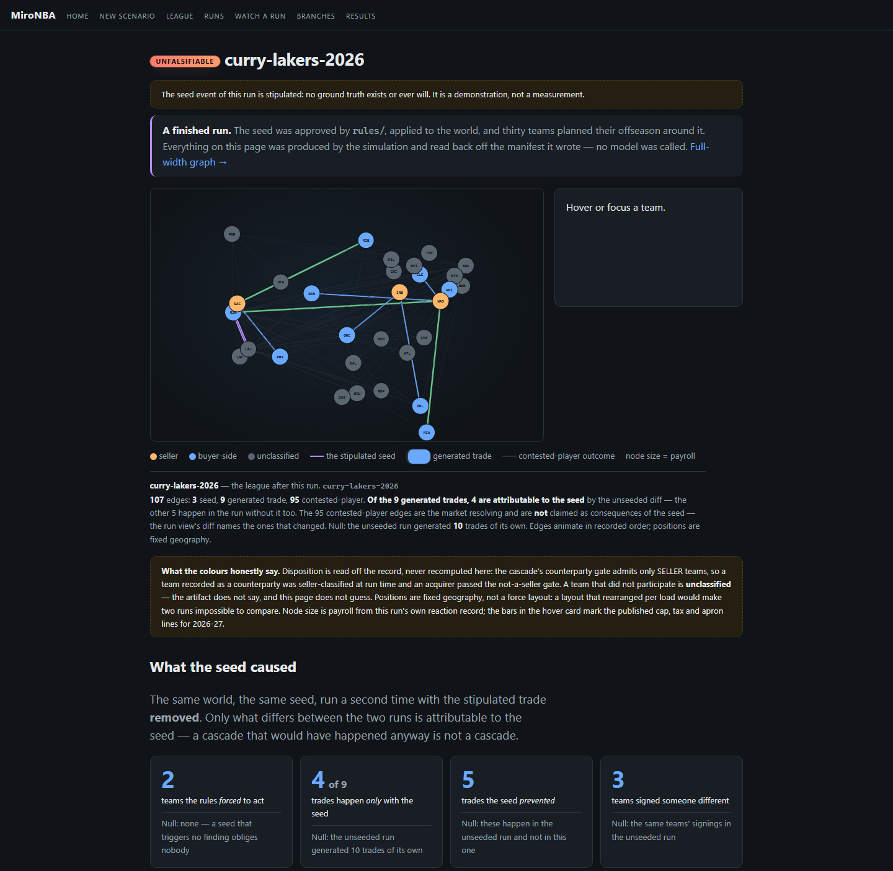

# MiroNBA

**Stipulate a trade or a signing that never happened.
Check it against the CBA. Watch thirty teams react.**

You write a sentence. The rules engine approves it, or refuses it and quotes
the shortfall to the dollar. Then the league reacts.



*A finished run. Thirty teams, the seed edge in purple, generated trades in
green, contested players in grey — and under it the count that matters: of
the 9 generated trades, **4 are attributable to the seed**, against 10 in the
run without it.*

## Quickstart

```bash
pip install -r requirements.txt

python -m mironba.api.serve        # the UI on http://127.0.0.1:8300
```

A clone ships with one reference run, so the graph above is on screen
immediately. To produce another — deterministic, about six seconds, no model
call anywhere in it:

```bash
python -m mironba.sim.stipulated --scenario curry-lakers-2026 \
    --out runs/curry-lakers-2026/manifest.json
```

## What is not seedable, and will not be

Injuries, rule changes, draft outcomes and player development. The seed is a
*transaction* — who moves where, or who signs where — because that is what
`rules/` can rule on. A system that accepted *"what if Wembanyama tore his
ACL"* would be inventing the very thing it claims to check. The boundary is
the point, not a gap.

An LLM may *propose*; only `rules/` may *approve*. The model names players and
selects from a list — it never emits a package, never states terms, and
nothing it says reaches world state without passing the validator.

## The boundary finding — the most portable claim here

**Features the constraint solver has already consumed carry no ranking
signal; features that precede it do.** Two rankers, two units, one result:

| unit | features sit... | observed | null | verdict |
| --- | --- | --- | --- | --- |
| team pair | downstream of the solver | p@10 6.0% | 5.01% permutation | 1.20x — inside noise |
| player | upstream of the solver | p@25 **11.2%** | 7.0%±1.5% within-team | clears at P=0.0026 |

The general form: **in a system with a hard constraint layer, put the model
upstream of the constraints, not downstream** — downstream, the
discriminative variance has already been spent. The player number survived
two leak corrections to get there, and the correction chain is in
[the standing boundary](docs/boundary.md).

## Headline results

Every number here appears beside what a random or do-nothing system scores on
the same data. Including the ones that lost.

**What the model is shown decides what it can want.** Same local model, same
scenarios, three information arms — the strongest positive result here, and a
controlled one: each arm is the others' control, and stand-pat rates of
19.4/19.4/20.7% rule out "attempting less".


**An LLM cannot do salary matching.** 0 legal trades in 12 attempts, against a
validator that approves nothing unconditionally. The two-step — model states
an intent, `rules/solver.py` enumerates legal packages — is what made the
trade path work at all.

**The deadline planner does not beat a random proposer.** Measured precision
1 in 421 proposals. It is reported at that resolution rather than rounded
into a claim.

**A win delta carries about 10.5 wins of error.** So options closer than 10.5
wins apart are not ranked, and the value model never breaks a tie it cannot
see.

Figures are generated by
[`mironba/report/figures.py`](mironba/report/figures.py) from the recorded
bench files and the measurements ledger — never from numbers typed into
plotting code. A moved anchor fails the build; it never silently plots a
default.

## Deeper

| | |
| --- | --- |
| [Results](docs/results.md) | Every measured result in full, each beside the null it was scored against — including the ones that lost. |
| [Results that weren't](docs/retracted.md) | Seven results that did not survive their own checks, and what each one turned out to be. |
| [The standing boundary](docs/boundary.md) | What the model is allowed to see and do, and how each limit is enforced. |
| [Architecture](docs/architecture.md) | The two paths through the system, the one approver, and how the pieces fit. |
| [Limitations](docs/limitations.md) | What this does not do, what remains unmeasured, and how to read a verdict correctly. |
| [Walkthrough](docs/walkthrough.md) | The canonical scenario, the authoring flow, and what a run produces. |
| [Measurement ledger](docs/measurements.md) | The running record — every number, when it was taken, and what it replaced. |

---

1277 tests. The eval harness is the product: most of what is recorded above
are negative results, and they are the point — the simulation is ordinary,
and the harness around it is built to report failure at the resolution needed
to act on it.
