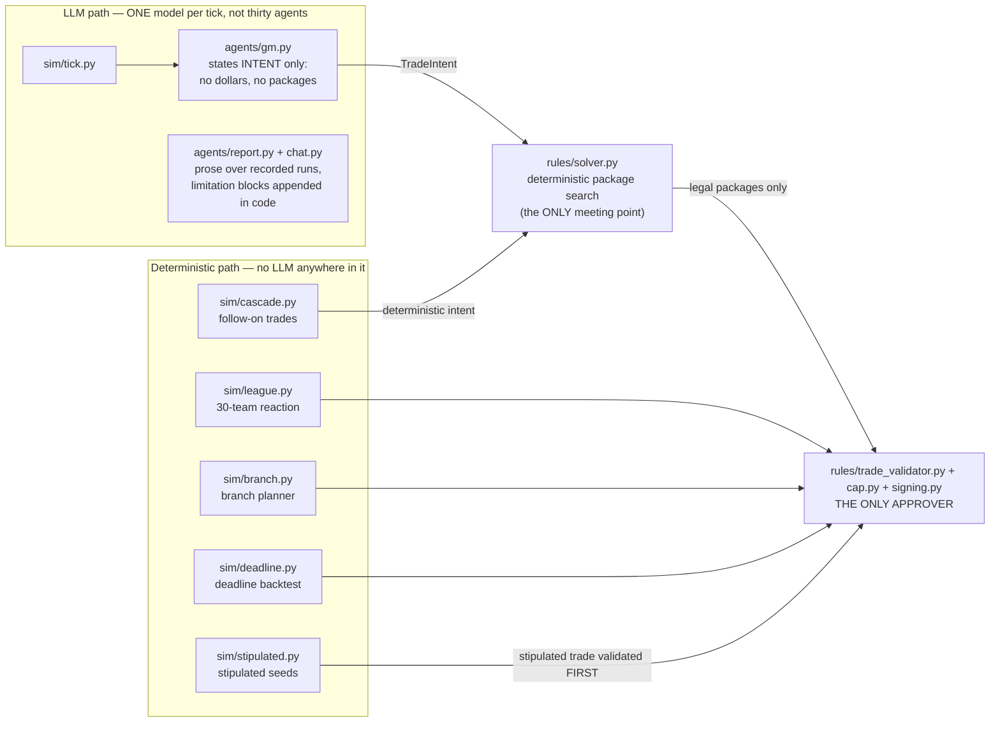

# Architecture

The two paths through the system, the one approver, and how the pieces fit.

[← back to the README](../README.md)

---

## Architecture: two paths, one approver

An LLM may *propose*; only `rules/` may *approve*. The model names players and
selects from a list — it never emits a package, never states terms, and
nothing it says reaches world state without passing the validator.



The two paths meet at the solver and nowhere else. An LLM cannot reach the
validator directly — illegal packages are unrepresentable, not merely
discouraged. Salary-cap math, trade legality and roster construction are
Python; a proposal the rules refuse is refused with findings, including the
project's own stipulated premises.

**If you read only three sections**:
[the boundary finding](#the-boundary-finding-rank-upstream-of-the-constraints) ·
[seven results that weren't](#seven-results-that-werent) ·
[the standing boundary](#the-standing-boundary).
Full map: [measured results](#what-was-measured) ·
[results that weren't](#seven-results-that-werent) ·
[the standing boundary](#the-standing-boundary) ·
[the full measurement ledger](docs/measurements.md) (62 entries — every
number, what it overturned, what changed because of it).

---

## How it is put together

```
                  ┌────────────────────────────────────────┐
  data/           │ Basketball-Reference  ->  contracts    │ scraped, not redistributed
                  │ stats.nba.com         ->  box scores   │ league API, committed
                  └───────────────┬────────────────────────┘
                                  v
  rules/    cap . trade_validator . solver . signing . signing_solver
            -- deterministic, unit-tested. Enumerates every LEGAL option.
                                  |
                  ┌───────────────┴────────────────┐
                  v                                v
  agents/   GM: names a player, an intent,    models/  value -> win_delta
            or an index. Never a salary,               -> delta_error -> compare
            never a package, never terms.              -- refuses to rank
                  |                                       inside its own error
                  └───────────────┬────────────────┘
                                  v
  world/    manifest . events . evidence (PRE|POST freeze) . pending decisions
                                  v
  sim/      tick . branch . league (contention + event-driven scheduler)
                                  v
  eval/     the only code allowed to read the answer
```
